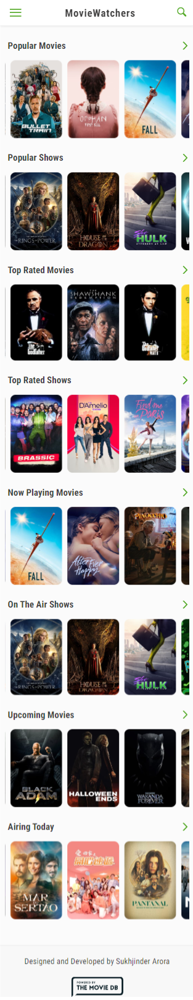
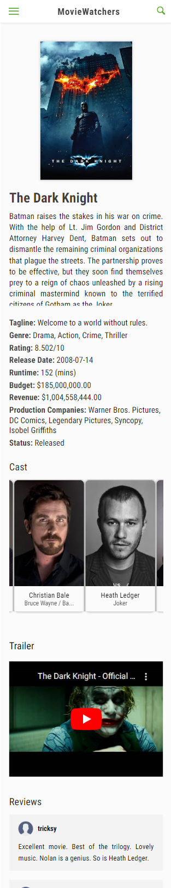
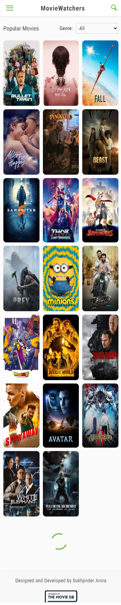
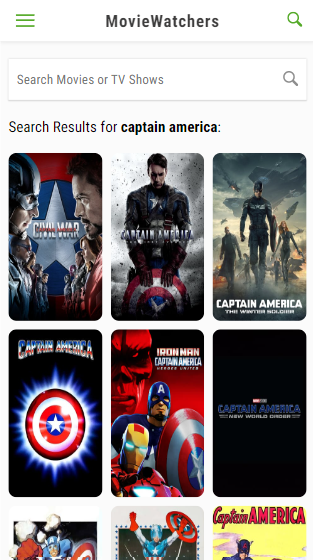
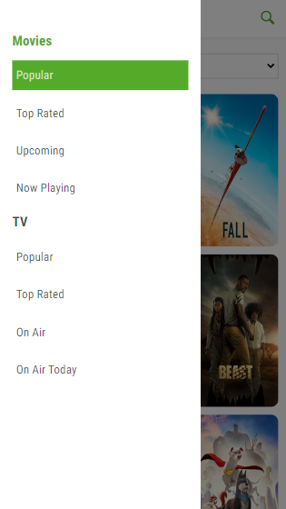

<h1 align="center">
  
  <br>
MovieWatchers - Find Something to Watch
</h1>

<font size="3">
MovieWatchers is an app in which you can:

- Search for movies and TV shows.
- Get ratings and reviews of movies and TV shows by TMDB users.
- Get the list of popular movies and TV shows.
- Get the list of toprated movies and TV shows.
- Get the list of all the upcoming movies
- Get the list of movies that are in the cinemas right now.
- Get the list of on air TV shows.
- Get the list of TV shows airing today.
- Filter movies and TV shows by genre.
- Get recommendations that are similar to a movie or TV show in the Movie or TV show details page.

**_Take a look at the live version here:_** https://moviewatchers.netlify.app/

# Technologies Used

This project is built using:

- ReactJS
- React Router V6
- Redux
- Redux-Thunk

# Development Workflow

### Steps to run this application locally:

1. Start by cloning the repository into your local file system.

   ```bash
   git clone https://github.com/SukhjinderArora/movie-watchers.git
   ```

2. CD in to the project directory

   ```bash
   cd movie-watchers
   ```

3. Open the repository in your favorite code editor.
4. Rename the `.env.example` to `.env` and set up all the environment variables mentioned in that file.
5. Finally run this command to start the application:

   ```bash
   npm start
   ```

   This command starts a local development server, opens application in your default browser, and watches for changes via livereload.

6. Optionally, you can use `npm run build` to build the production version of the application.

# Screenshots

## Home Page


## Movie Details Page


## Search Page


## Movies Page


## TV Shows Page


# Responsive Design

This is web app is fully responsive to devices of all screen sizes. For example:

<p align="top" overflow="hidden">
  
  
   
</p>
<p align="top">
  
  
   
</p>

# Deploying To Netlify

Follow this guide to deploy the application to Netlify: https://docs.netlify.com/get-started/#deploy-a-project-to-netlify

# Credits:

## This app uses :

- [TMDB](https://www.themoviedb.org/documentation/api) API to get all movie, tv and people related data.

- Favicon made by [mynamepong](https://www.flaticon.com/authors/mynamepong) from [flaticon.com](https://www.flaticon.com/).
  
# License

MIT License
